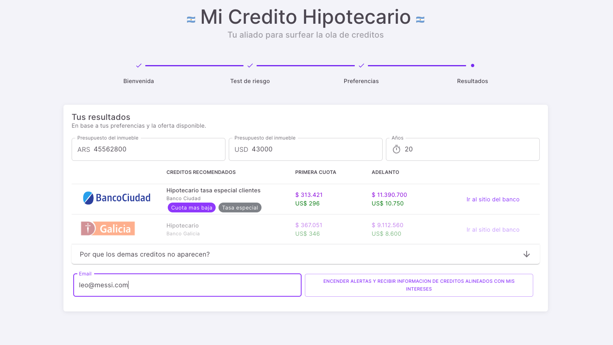

# Mi Credito Hipotecario
#### Tu aliado para surfear la ola de creditos




Mi Credito Hipotecario es una aplicación web que permite a los usuarios simular un crédito hipotecario, con el fin de obtener una idea de cuánto tendrían que pagar mensualmente por un crédito hipotecario.

micreditohipotecario.com.ar

Telegram: www.t.me/micreditohipotecario


## Installation ⚒️

Installing and running the template is super easy in Materio, please follow these steps and you should be ready to rock 🤘

1. Make sure you have installed Node.js (LTS). If Node.js is already installed in your system, make sure the installed version is LTS (and not the latest version)
2. Navigate to the `typescript-version` or `javascript-version` folder and run the following command to install our local dependencies listed in `package.json`. You can use `npm` OR `yarn` as per your preference.

> It is recommended to use yarn for better dependency management

```bash
# For npm
npm install --legacy-peer-deps

# For yarn
yarn install
```

3. Now, you are ready to start the server with the help of the command shown below. Open [http://localhost:3000/](http://localhost:3000/) to check your development 🚀.

```bash
# For npm
npm run dev

# For yarn
yarn dev
```
